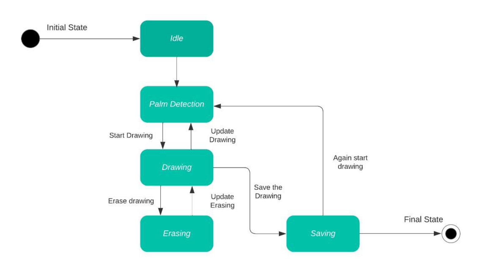

# Virtual AI Whiteboard System 

## 1.0 Abstraction:

The computer vision field has been rapidly developing, finding real-world applications, and even surpassing humans in solving some of the visual tasks. All thanks
to the recent advancement in artificial intelligence and machine learning. Object tracking is considered as one the important task within the field of computer vision.
Virtual Whiteboard is a novel application that allows users to create digital drawings and presenting presentations using hand gestures. This innovative technology
is designed to enhance the user experience and interaction, allowing users to create and control content without physically touching the screen or keyboard. The
system uses a combination of computer vision and machine learning algorithms to detect hand movements and translate them into digital actions. The Virtual
Whiteboard provides users with a variety of tools and features to create and manipulate digital content, including drawing and writing tools It a versatile 
and powerful tool for communication and collaboration. Overall, the Virtual Whiteboard is a powerful and versatile tool that enhances user experience and 
interaction, providing a new way to create and control digital content.

`keywords/summery words`: Computer Vision(CV),artificial intelligence, Object Tracking, Virtual Whiteboard, create content  

---------------------------------------

## 2.0 Introduction 

Virtual Whiteboard is a cutting-edge application that enables users to create digital drawings and presentations using hand gestures. This innovative
technology provides a new way for users to interact with digital content, offering a more natural and intuitive user experience. The application uses
advanced computer vision and machine learning algorithms to detect and interpret hand gestures, allowing users to create and manipulate content with
ease. Virtual Whiteboard is designed to be a versatile and powerful tool for communication and collaboration. With a variety of tools and features, users
can create and manipulate digital content to their liking. Drawing and writing tools, and OS event controlling capabilities are all available in the
application. The application's easy-to-use interface makes it accessible to users of all skill levels, allowing them to create and manipulate digital content
with hand gestures quickly.

### 2.1 Drawbacks of the Existing System

Instead of traditional ways our systems allow users to draw, annotate, and interact with digital
content in real-time, mimicking the experience of traditional whiteboards while 
offering additional functionalities and automation.

As of now we are using Mouse to perform tasks on the screen. Mouse-based navigation has been a standard input
method for decades. Using a mouse for long periods of time can cause physical strain on the hand, wrist, and arm,
leading to repetitive strain injuries like carpal tunnel syndrome. To overcome that physical pain we are using
gesture-based navigation and control to use hand movements for handling some basic os system-event handling
and illustrating. virtual writing can quickly solve these problems as it eliminates the need for physical touch
and allows for more efficient control & communication

### 2.2 Objective of the project research

Investigate the usability and user experience of a virtual whiteboard with gesture control as compared to traditional whiteboards or digital whiteboards
with pen input. Evaluate the impact of a virtual whiteboard with gesture control on collaborative learning, knowledge retention, and engagement in
educational settings. Analyze the potential benefits and limitations of using a virtual whiteboard with gesture control in various educational contexts,
including remote and hybrid learning environments. Identify the key design and technical requirements for developing an effective and user-friendly
virtual whiteboard with gesture control. Provide recommendations and guidelines for educators and developers on how to integrate and utilize virtual
whiteboards with gesture control in teaching and learning. Investigate the impact of hand gesture control on user engagement, interaction, and overall
presentation experience. Analyze the potential benefits and limitations of using hand gesture control

The leser important objective is to focus on some gesture-based operating system-event handling By using hand movements instead of using mouse, 
gesture-based navigation aims to make it easier and more efficient to users to perform tasks

----------------------------------------------------------------

## 3.0 litrature Survey

Literature Survey on AI Whiteboard Systems

### 3.1 Gesture-Based Interaction Techniques for Interactive Digital Whiteboards: A Review" by Priyadarshini and Subudhi (2021)

This review article explores gesture-based interaction techniques for interactive 
digital whiteboards. The paper discusses various gesture recognition methods, 
including vision-based approaches, sensor-based approaches, and hybrid techniques.
The study evaluates the advantages, limitations, and potential applications of 
gesture-based interaction in digital whiteboard systems.

### 3.2 A Survey of Hand-Centric Approaches for Human-Computer Interaction" by Li, et al. (2020)

This survey provides an overview of hand-centric approaches for human-computer interaction (HCI),
including hand detection, gesture recognition, and fingertip tracking. The paper discusses various
techniques and algorithms used in HCI systems, with a focus on their applications in interactive 
whiteboard systems.

### 3.3 Deep Learning-Based Hand Gesture Recognition for Human-Computer Interaction in Smart Whiteboard Systems" by Zhang, et al. (2019)

This paper presents a deep learning approach for hand gesture recognition in smart whiteboard systems. 
The study explores the use of convolutional neural networks (CNNs) for detecting and recognizing 
hand gestures, enabling intuitive interaction with digital content on whiteboards.

### 3.4 Survey of Gesture Recognition Techniques for Human-Computer Interaction" by Iqbal and Khalid (2019)

Iqbal and Khalid conduct a survey of gesture recognition techniques for human-computer
interaction (HCI), including hand gestures, body gestures, and facial expressions. The
paper discusses the challenges and opportunities in gesture recognition research and 
provides insights into the design and development of gesture-based HCI systems.
These studies offer valuable insights into the design, implementation, and applications
of AI whiteboard systems, highlighting the importance of gesture recognition, hand 
tracking, and interactive features for enhancing collaboration, communication, and 
learning experiences

### 3.5 Real-Time Gesture Recognition for Interactive Whiteboard Systems Using Convolutional Neural Networks" by Lee, et al. (2018)

Lee et al. propose a real-time gesture recognition system for interactive whiteboards using CNNs. 
The system detects hand gestures and translates them into digital commands, allowing users to 
interact with whiteboard content seamlessly. The study evaluates the system's performance in 
terms of accuracy and latency.

### 3.6 An Intelligent Interactive Whiteboard System for Education" by Li, et al. (2017)

Li et al. propose an intelligent interactive whiteboard system specifically 
designed for educational purposes. The system combines computer vision, 
machine learning, and natural language processing techniques to facilitate
interactive learning experiences. The paper discusses the system architecture,
features, and potential benefits for educational settings.

### 3.7 Interactive Whiteboards in Education: A Literature Review" by Betcher and Lee (2013)

This literature review examines the use of interactive whiteboards (IWBs) in 
education, focusing on their impact on teaching and learning outcomes. The study
synthesizes findings from previous research and identifies key themes related to
the effectiveness and challenges of integrating IWBs into educational practices.

### 3.8 A Review of Interactive Whiteboard Use in Teaching and Learning in Higher Education Institutions" by Price (2012)

Price provides a comprehensive review of interactive whiteboard use in higher education
institutions. The paper discusses the pedagogical benefits, challenges, and best practices
associated with integrating interactive whiteboards into teaching and learning environments.
The study also examines factors influencing the adoption and effective use of IWBs in 
higher education.

### 3.9 J. Cheng, L. Li, & X. Li Proposed definition for gesture-based operating system navigation and control.

He defined gesture-based OS navigation is a system that enables users to interact 
with their computer's operating system through hand gestures, without the need for
a physical input device like a mouse or keyboard.The system typically uses computer
vision algorithms to recognize and interpret these gestures, and then maps them to
various functions and commands within the operating system.

### 3.10 R. C. Jain & S. S. Saurabh Proposed definition for "Gesture Recognition for Operating System Navigation".

He defined Gesture-based OS navigation systems often use machine learning algorithms
to recognize and classify hand gestures, which can improve the accuracy and 
responsiveness of the system.The survey also highlighted some of the challenges and
limitations of gesture recognition systems, including the need for high-quality 
sensors and cameras to capture accurate data, the need for large datasets of 
annotated gestures to train machine learning models, and the challenge of dealing
with variations in lighting, background noise, and other environmental factors 
that can impact the accuracy of the system.

### 3.11 L. Guo, C. Huang, and Z. Zhao  conducted a literature survey on A Multi-user Collaborative System for Creative Drawing. 

The authors described the technical components of the system, including the computer 
vision algorithms used for gesture recognition, the communication protocol for transmitting
data between devices, and the user interface design. They also evaluated the system's 
performance in terms of accuracy, latency, and user satisfaction through a user study.

---------------------------------------------------------------------

## 4.0 Feasibility study

### 4.1 Hardware fesibility: 

The system requires a camera for capturing user interactions and a computing device for processing images
and running deep-learning models. These components are readily available and affordable, making the 
project technically feasible.

### 4.2 Software fesibility: 

Development frameworks such as TensorFlow or PyTorch can be used to implement deep learning algorithms
but we can use pre-trained libraries like OpenCV MediaPipe for hand and fingertip detection. 
libraries for computer vision and user interface development are widely accessible, enhancing
the feasibility of software implementation.

### 4.3 Market Feasibility:

The primary target audience for the AI whiteboard system includes educational 
institutions, corporate organizations, and individuals seeking innovative collaboration tools.
The widespread adoption of digital learning platforms and remote work arrangements increases 
the demand for intuitive and interactive solutions like AI whiteboards.

While there are existing digital whiteboard solutions available, AI whiteboard systems offer
unique capabilities such as gesture-based interaction and real-time collaboration. Conducting
market research to identify competitors, customer needs, and potential market niches will be 
essential for positioning the product effectively.

### 4.3 Education: 

In educational settings, AI whiteboards can facilitate remote learning and 
enhance classroom collaboration. Teachers can deliver interactive lessons, annotate 
content in real time, and provide personalized feedback to students.

### 4.4 Business and Meetings: 

In corporate environments, AI whiteboards streamline brainstorming 
sessions, presentations, and project collaboration. Participants can ideate, share ideas,
and collaborate on digital canvases regardless of their physical location.

### 4.5 Accessibility: 

AI whiteboards can improve accessibility for individuals with disabilities
by providing alternative means of interaction. Users with mobility impairments, for example,
can utilize gesture-based controls to engage with digital content more effectively.

--------------------------------------
## 5.0 Methodology & Planning

The total process of the system is explained in simple
sequence diagram as shown :

The methodology implemented in the system is divided into
four modules as follows :

### 5.1 Capture frames OpenCV

CV2 is a popular computer vision library for Python. It is the Python interface for OpenCV (Open-Source Computer
Vision Library), a powerful and comprehensive library for image and video processing. It provides a wide range of
functions and tools for tasks such as image manipulation, object detection, facial recognition, feature detection, and
more. It supports various image and video file formats, including BMP, JPEG, PNG, and MPEG.
Some of the key features of cv2 include image and video capture, image processing and filtering, object detection and
tracking, and feature detection and extraction. It also includes functions for creating graphical user interfaces for
computer vision applications.cv2 is widely used in the computer vision and image processing fields and is popular
among developers and researchers. Its powerful functionality and ease of use make it a valuable tool for a wide range
of applications, from simple image editing tasks to complex computer vision research projects

### 5.2 Hand detection MediaPipe

MediaPipe is a cross-platform framework for building multimodal applied ML pipelines. It is developed by Google and
provides a collection of building blocks for creating complex computer vision and machine learning pipelines.
MediaPipe offers pre-built components for tasks such as object detection, hand tracking, face detection and
recognition, pose estimation, and many others. MediaPipe provides a flexible and easy-to-use pipeline for developers,
allowing them to build custom models and pipelines without having to implement everything from scratch. The
framework supports a variety of platforms, including desktop, mobile, and the web.
MediaPipe is an open-source project and can be used under the Apache 2.0 license. It is built using the TensorFlow
framework and provides pre-trained models for many tasks, which can be easily integrated into your own
projects.MediaPipe is a powerful tool for developers who want to add computer vision and machine learning
capabilities to their applications, without having to spend a lot of time on building and training models from scratch.
Hand Gestures recognition works in two main phases:- palm detection and hand landmarks.

#### 5.3 Palm Detection 

The primary goal of palm detection is to identify the presence and location of a hand in the given input. For
this the module utilizes a machine learning model trained to recognize the general structure and appearance of a human hand. It
scans the input frames and identifies areas that likely contain a hand based on learned patterns. Once a hand is detected, the
system provides information about the bounding box or region around the detected palm. This information serves as the
foundation for further hand gesture analysis.

#### 5.4 Hand Landmarks

Hand landmarks involve the identification of specific points or landmarks on the detected hand, allowing for
detailed tracking of its pose and movements. After palm detection, the module further analyzes the hand by identifying key
landmarks, such as the tips of the fingers, the base of the hand, and points along the contours of the palm.
The system outputs the 2D coordinates of these hand landmarks, providing a comprehensive understanding of the hand's spatial
configuration. The landmark information enables precise tracking and interpretation of hand gestures. MediaPipe can pinpoint and
recognize 21 specific points on a hand when given a close-up image, allowing for precise tracking of hand positions and gestures.

#### 5.5 Canavas event

Creating a canvas experience that's both intuitive and smooth with functionality and performance.
In project, users can seamlessly in real-time.

* Select 
* Draw 
* Erase
* Switch between Colors
* Save their creations. 

  

#### 5.6 os.event handling

**os Module**
The built-in os module provides a way to interact with the operating system, 
allowing us to perform tasks like file and directory manipulation, 
process management, and more.

**subprocess Module**
The subprocess module allows you to spawn new processes, connect to 
their input/output/error pipes, and obtain their return codes. 
It's useful for running external commands and controlling their
behavior.

**keyboard and mouse Modules**
To control or simulate keyboard and mouse events, we can use 
third-party libraries such as keyboard and mouse. These libraries
allow you to interact with input devices programmatically.

---------------------------------------

## 6.0 Facility required for proposed work

### 6.1 Discussion:

#### Hardware Support:

* Our system demands robust hardware capabilities to ensure optimal performance and 
seamless user experience. The minimum hardware requirements include an X86_64 
architecture, a minimum of 8GB RAM, and an i5 processor or equivalent. In addition, a depth
sensor camera is essential for enhanced functionality. the primary focus is on
64-bit systems, 32-bit, or ARM architecture  will not be officially supported. 

#### Software Support:

* The software is designed to operate on various operating systems,
providing flexibility and accessibility for users. The supported operating systems
include Windows 10, Linux, macOS, and BSD, all based on the X86_64 architecture.

* The software stack requires a system equipped with Python 3.9 and above, 
with a modern Chromium-based browser for user interaction. Core 
dependencies such as OpenCV and MediaPipe are needed

`note:` custom builds, Linux From Scratch (LFS) immutable system or Nix overlay, 
Gentoo packages or deprecated OS will not be supported either. (you need to build the bin yourself)

### 6.2 Current challenges

* Our project faces a couple of hurdles that we're actively addressing. First up, 
there's the task of seamlessly connecting the user interface (frontend) 
with the backend. we're working to make sure your clicks and inputs 
result in the right actions.

* Another challenge we're tackling involves handling image data captured by the
camera. Sometimes, the camera might act a bit like a flickering light, causing
disruptions in the images we're trying to process. We're on it, though, 
figuring out ways to smooth out these hiccups and make sure your visuals
are consistently reliable.

* Lastly, there's the matter of performance. It's like making sure your computer
runs smoothly even when you have multiple applications open. Our goal is to 
optimize the performance of our system so that you experience quick response 
times without any annoying lags. We're putting in the effort to fine-tune 
things and ensure a smooth user experience.

### 6.3 Applications and Future Work:

The scope of this project is
It will produce effective communication between people
that will reduce the use of laptops and mobile phones by
abolishing the writing need. The major scope is in the
teaching field while teaching online or teaching on screen.
Without the mouse or any markers, we can easily implement
on the screen. It will be used in designing purposes to create
immersive or interactive designs.

* Cross-Platform Compatibility: Extend compatibility to
various operating systems and applications, making the
system adaptable to different user needs

* User Customization: Develop features that enable users
to customize gesture definitions, making the system more
personalized and versatile.

* Performance improvement and Extended bug fixings and maintenance

### 6.4 Conclusion:

The system significantly contributes to the field of
interactive learning and computer vision-based writing
applications. By integrating existing approaches and
introducing novel features, our solution offers a robust and
versatile virtual canvas platform. Through the usage of
MediaPipe and OpenCV, we have improved user experience
and interaction.

The field of Human-Computer Interaction has witnessed a
remarkable transformation with the development and
implementation of the Gesture-based system presented
in this project. This innovative system enables users to
interact with digital interfaces through intuitive hand
gestures, providing a level of versatility and naturalness that
traditional input devices struggle to match. Our project has
addressed the limitations of conventional drawing tools,
offering a seamless and efficient solution for users to
perform a wide range of tasks. 

-----------------------------------------------------------
## 7.0 bibliography

list of refrences

1. Rafiqul Zaman Khan, Noor Adnan Ibrahim “Hand gesture recognition” IJAIA 2020
2. Z. Hu, X.Zhu “Gesture detection from RGB hand image using modified convolutional neural network.” IEEE 2019
3. P.Kirchi, M.Cambek “Hand Gesture detection” IEEE 2019
4. I.Dhall, S.Vashisth, G.Aggarwal “Automated Hand Gesture Recognition using a Deep Convolutional Neural Network model.” IEEE 2020
5. S.Bansode, S.Varkhad, S.Dhaigude, S.Waghmare, S.Suryawanshi “Computer Vision Based Virtual Sketch Using Detection.” IJRASET 2022
6. Y.Patil, M.Paun, D.Paun, K.Singh, V.Borate “Virtual Painting with Opencv Using Python.” IJSRST 2020
7. Niharika M, Neha J, Mamatha Rao, Vidyashree K P “Virtual paint using hand gesture” IRJET 2022
8. M.Idrees, M.Butt, A.Ahmad, H.Danish “Controlling PowerPoint using hand gesture in Python” ResearchGate 2021
9. P.Srungavarapu, P.maganti, S.Sakhamura, “Virtual Sketch using Open CV” IJITEE 2020
10. Z.Yuan, G.Jil, “Sketch recognition based intelligent whiteboard teaching system” ICCSSE 2008

